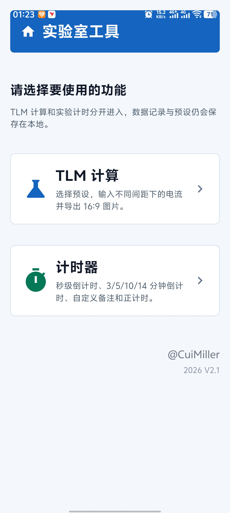
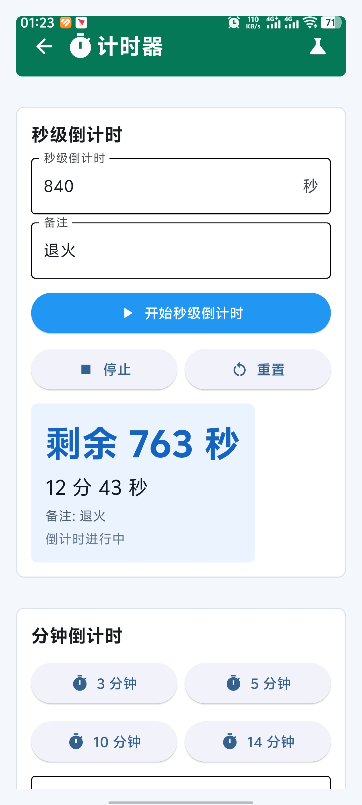
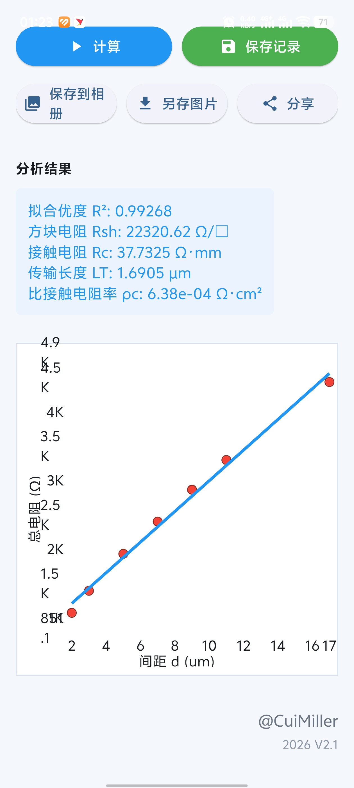
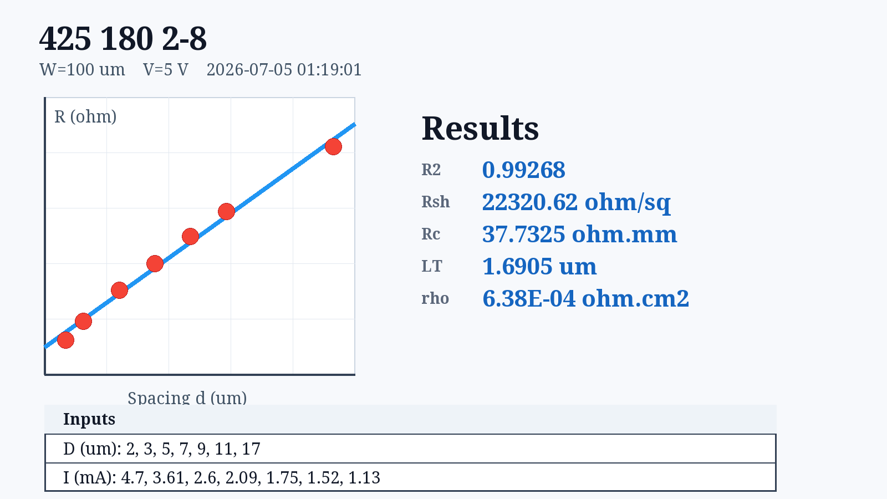

# TLM APP

实验室用 TLM 计算与计时工具，使用 Python + Flet 编写，Android 版本保留 `LineChart` 图表功能。

这个软件主要服务于用 B1500 测试 TLM 的场景：测试时通常只有电流和电压图，想进一步计算 `Rc`、`Rsh`、`LT`、`ρc` 和线性拟合结果，需要回到电脑整理数据。TLM APP 的目标是把这一步放到手机上完成，实验时直接输入数值即可计算、拟合、查看图表并导出结果图片。

## 功能

- TLM 计算：选择预设，输入不同间距下的电流，自动计算 `Rsh`、`Rc`、`LT`、`ρc` 和拟合优度。
- 图表显示：在手机端直接显示拟合曲线和测量点。
- 图片导出：生成 16:9 PNG 图片，保存到手机可见目录。
- 历史记录：最多保存 1500 条测试记录。
- 预设管理：可保存、编辑、删除 TLM 间距、数量、通道宽度和测试电压。
- 计时器：支持秒级倒计时、3/5/10/14 分钟倒计时、自定义备注和正计时。

## 截图

| 首页 | 计时器 |
| --- | --- |
|  |  |

| TLM 结果 | 16:9 导出图片 |
| --- | --- |
|  |  |

## v2.1.12 修复重点

- 修复 Android 启动白屏问题。
- 修复 Android 手机端历史记录、设置弹窗和窄屏布局问题。
- 修复计时器切到后台后计时停止的问题。
- 修复 Android 图片保存路径不可见的问题，优先保存到 `1aTLM` 或 Android 可见媒体目录。
- 修复导出图片像素字体问题，Android 打包加入 Pillow，导出字体更接近桌面版效果。
- 修复错误的 `permission_handler` 控件导致的红屏问题。
- 保留 Flet `LineChart` 图表功能，因此 Android 端继续使用 `flet==0.28.3`。

## 下载

请在 GitHub Releases 下载最新 Android APK：

https://github.com/cuimiller666-code/TLM-APP/releases

## 本地 Android 打包

本仓库包含一个本地打包脚本，默认把 Flutter、JDK、Android SDK 和 Gradle 缓存放到 `E:\andanid`：

```powershell
powershell -ExecutionPolicy Bypass -File E:\123\TLM-APP\build-local-apk.ps1
```

如果打包前有旧进程占用文件，可以先关闭旧构建进程后再打包。
